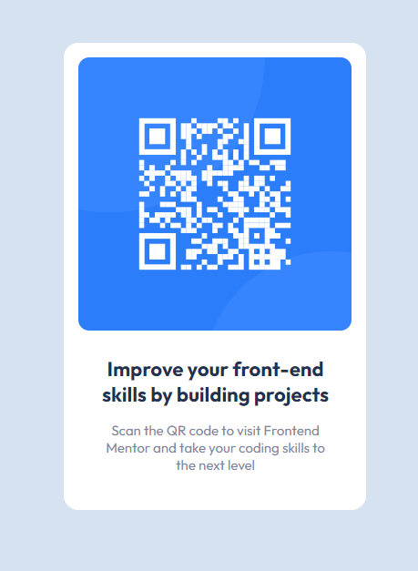

# Frontend Mentor - QR code component solution

This is a solution to the [QR code component challenge on Frontend Mentor](https://www.frontendmentor.io/challenges/qr-code-component-iux_sIO_H). Frontend Mentor challenges help you improve your coding skills by building realistic projects. 

## Overview

### Screenshot

### Links

- [Solution URL](https://github.com/Matt1994/FrontendMentor-QR-Code)
- [Live site URL](https://Matt1994.github.io/FrontendMentor-QR-Code)

## My process

### Built with

- Semantic HTML5 markup
- CSS Grid
- Mobile-first workflow

## Author

- Website - [m5w.dev](http://www.m5w.dev)
- Frontend Mentor - [@Matt1994](https://www.frontendmentor.io/profile/Matt1994)